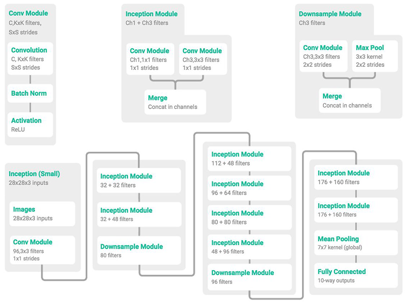

# MiniGoogLeNet-PyTorch

It's a PyTorch version of MiniGoogLeNet, adapted from Tensorflow version of MiniGoogLeNet

## Author: Yuanzhe Liu

This notebook is highly inspired and referenced by the following link:

https://github.com/meng1994412/GoogLeNet_from_scratch/blob/master/pipeline/nn/conv/minigooglenet.py

## Introduction

This MiniGoogLeNet architecture is from [here](https://arxiv.org/abs/1611.03530).

Below is the architecture of MiniGoogLeNet:

For the usage of MiniGoogLeNet on MNIST dataset and [CIFAR-10 dataset](https://www.cs.toronto.edu/~kriz/cifar.html), please take a look at the jupyter notebook MinGoogLeNet.ipynb, or access my notebook on colab over [here](https://colab.research.google.com/drive/1dVUFf7nMMzwDiFdmvizxK7tVUwAVQ9vw?usp=sharing).

Feel free to raise an issue if any questions or problems related to this repo.

## Reference

[https://github.com/meng1994412/GoogLeNet_from_scratch](https://github.com/meng1994412/GoogLeNet_from_scratch)
